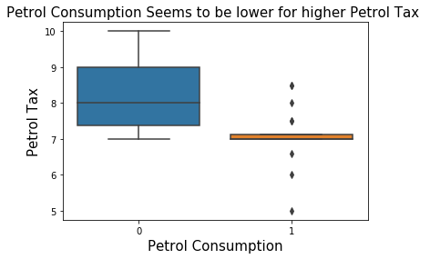
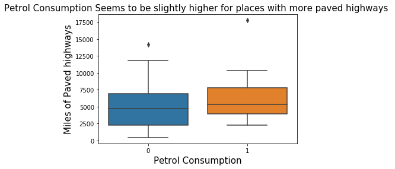
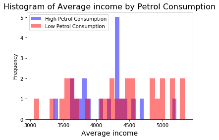
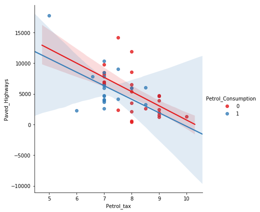
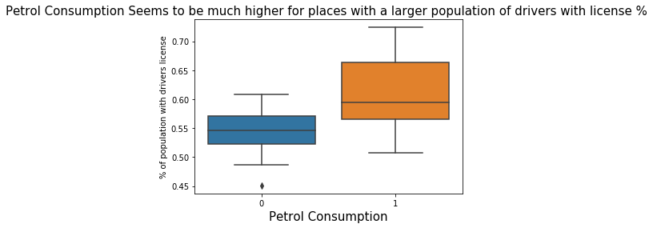
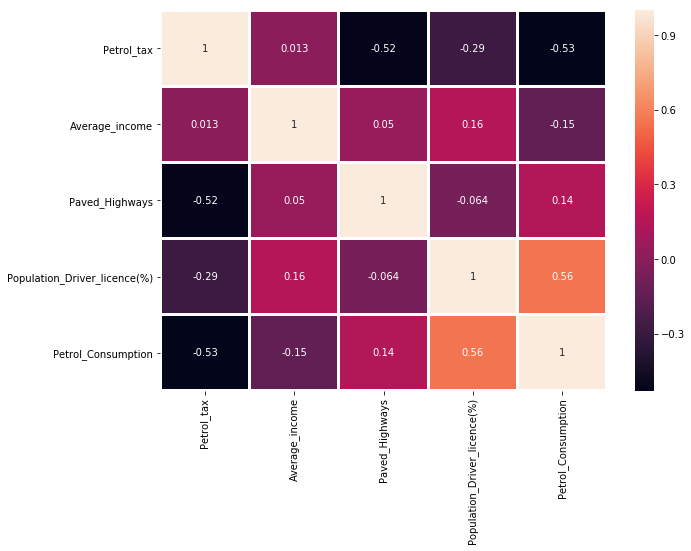
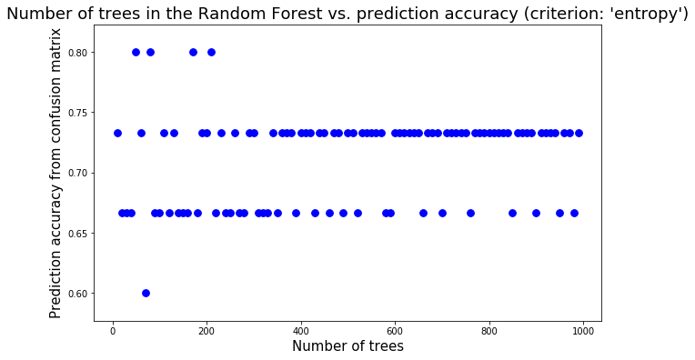

# Decison-Tree-and-Random-Forest
Using Python to predict gas consumption (low or high, 0 or 1) in 48 of the US states based on petrol tax (in cents), per capita income (dollars), paved highways (in miles) and the proportion of population with the driving license.


# Decision Tree and Random Forest 

The goal:
predict gas consumption (low or high, 0 or 1) in 48 of the US states based on petrol tax (in cents), per capita income (dollars), paved highways (in miles) and the proportion of population with the driving license.
1)	Import Libraries
2)	Import Dataset
3)	Perform basic EDA – your choice (come up with 3 insights)
4)	Classification:  
a.	Train a basic decision tree preparing variables as necessary for the model
b.	Analyze the results of the decision tree classification following our example
5)	Classification:  Random Forest
a.	Train a basic random forest model preparing variables as necessary for the model
b.	Analyze the results of the random forest classification following our example


# Import Libraries and data set

**Import the usual libraries for pandas and plotting**


```python
import pandas as pd
import numpy as np
import matplotlib.pyplot as plt
import seaborn as sns
%matplotlib inline
```

### 1. Get the Data: Use pandas to read petroleum cnsumption**


```python
df = pd.read_csv('petrol_consumption_low_high.csv')
```

### 2. Check out the info(), head(), and describe() methods on petrol consumption


```python
df.info()
```

    <class 'pandas.core.frame.DataFrame'>
    RangeIndex: 48 entries, 0 to 47
    Data columns (total 5 columns):
    Petrol_tax                      48 non-null float64
    Average_income                  48 non-null int64
    Paved_Highways                  48 non-null int64
    Population_Driver_licence(%)    48 non-null float64
    Petrol_Consumption              48 non-null int64
    dtypes: float64(2), int64(3)
    memory usage: 2.0 KB
    


```python
df.head()
```


<div>
<style scoped>
    .dataframe tbody tr th:only-of-type {
        vertical-align: middle;
    }

    .dataframe tbody tr th {
        vertical-align: top;
    }

    .dataframe thead th {
        text-align: right;
    }
</style>
<table border="1" class="dataframe">
  <thead>
    <tr style="text-align: right;">
      <th></th>
      <th>Petrol_tax</th>
      <th>Average_income</th>
      <th>Paved_Highways</th>
      <th>Population_Driver_licence(%)</th>
      <th>Petrol_Consumption</th>
    </tr>
  </thead>
  <tbody>
    <tr>
      <th>0</th>
      <td>8.0</td>
      <td>5319</td>
      <td>11868</td>
      <td>0.451</td>
      <td>0</td>
    </tr>
    <tr>
      <th>1</th>
      <td>8.0</td>
      <td>4399</td>
      <td>431</td>
      <td>0.544</td>
      <td>0</td>
    </tr>
    <tr>
      <th>2</th>
      <td>7.5</td>
      <td>4870</td>
      <td>2351</td>
      <td>0.529</td>
      <td>0</td>
    </tr>
    <tr>
      <th>3</th>
      <td>10.0</td>
      <td>5342</td>
      <td>1333</td>
      <td>0.571</td>
      <td>0</td>
    </tr>
    <tr>
      <th>4</th>
      <td>8.5</td>
      <td>4574</td>
      <td>2619</td>
      <td>0.551</td>
      <td>0</td>
    </tr>
  </tbody>
</table>
</div>


```python
df.describe()
```


<div>
<style scoped>
    .dataframe tbody tr th:only-of-type {
        vertical-align: middle;
    }

    .dataframe tbody tr th {
        vertical-align: top;
    }

    .dataframe thead th {
        text-align: right;
    }
</style>
<table border="1" class="dataframe">
  <thead>
    <tr style="text-align: right;">
      <th></th>
      <th>Petrol_tax</th>
      <th>Average_income</th>
      <th>Paved_Highways</th>
      <th>Population_Driver_licence(%)</th>
      <th>Petrol_Consumption</th>
    </tr>
  </thead>
  <tbody>
    <tr>
      <th>count</th>
      <td>48.000000</td>
      <td>48.000000</td>
      <td>48.000000</td>
      <td>48.000000</td>
      <td>48.000000</td>
    </tr>
    <tr>
      <th>mean</th>
      <td>7.668333</td>
      <td>4241.833333</td>
      <td>5565.416667</td>
      <td>0.570333</td>
      <td>0.416667</td>
    </tr>
    <tr>
      <th>std</th>
      <td>0.950770</td>
      <td>573.623768</td>
      <td>3491.507166</td>
      <td>0.055470</td>
      <td>0.498224</td>
    </tr>
    <tr>
      <th>min</th>
      <td>5.000000</td>
      <td>3063.000000</td>
      <td>431.000000</td>
      <td>0.451000</td>
      <td>0.000000</td>
    </tr>
    <tr>
      <th>25%</th>
      <td>7.000000</td>
      <td>3739.000000</td>
      <td>3110.250000</td>
      <td>0.529750</td>
      <td>0.000000</td>
    </tr>
    <tr>
      <th>50%</th>
      <td>7.500000</td>
      <td>4298.000000</td>
      <td>4735.500000</td>
      <td>0.564500</td>
      <td>0.000000</td>
    </tr>
    <tr>
      <th>75%</th>
      <td>8.125000</td>
      <td>4578.750000</td>
      <td>7156.000000</td>
      <td>0.595250</td>
      <td>1.000000</td>
    </tr>
    <tr>
      <th>max</th>
      <td>10.000000</td>
      <td>5342.000000</td>
      <td>17782.000000</td>
      <td>0.724000</td>
      <td>1.000000</td>
    </tr>
  </tbody>
</table>
</div>


### 3a. Exploratory Data Analysis - Explore the data in a meaningful way in order to find variables of interest.  Create at least 6 visualizations that are meaningful and document your observations with a  markdown cell for each visualization


```python
sns.boxplot(x=df['Petrol_Consumption'],y=df['Petrol_tax'])
plt.title("Petrol Consumption Seems to be lower for higher Petrol Tax ", fontsize=15)
plt.xlabel("Petrol Consumption",fontsize=15)
plt.ylabel("Petrol Tax",fontsize=15)
```


    Text(0, 0.5, 'Petrol Tax')





```python
sns.boxplot(x=df['Petrol_Consumption'],y=df['Paved_Highways'])
plt.title("Petrol Consumption Seems to be slightly higher for places with more paved highways ", fontsize=15)
plt.xlabel("Petrol Consumption",fontsize=15)
plt.ylabel("Miles of Paved highways",fontsize=15)
```


    Text(0, 0.5, 'Miles of Paved highways')





```python
df[df['Petrol_Consumption']==1]['Average_income'].plot.hist(bins=30,alpha=0.5,color='blue', label='High Petrol Consumption')
df[df['Petrol_Consumption']==0]['Average_income'].plot.hist(bins=30,alpha=0.5, color='red', label='Low Petrol Consumption')
plt.legend(fontsize=10)
plt.title ("Histogram of Average income by Petrol Consumption", fontsize=16)
plt.xlabel("Average income", fontsize=14)
```


    Text(0.5, 0, 'Average income')





```python
plt.figure(figsize=(14,7))
sns.lmplot(y='Paved_Highways',x='Petrol_tax',data=df,hue='Petrol_Consumption',palette='Set1',size=6)
```

    C:\Users\p2840013\AppData\Local\Continuum\anaconda3_school\lib\site-packages\seaborn\regression.py:546: UserWarning: The `size` paramter has been renamed to `height`; please update your code.
      warnings.warn(msg, UserWarning)
    


    <seaborn.axisgrid.FacetGrid at 0x2260988c5c0>


    <Figure size 1008x504 with 0 Axes>





```python
##Interesting to see that there is a tiny negative correlation between tax and miles of highways.
```


```python
sns.boxplot(x=df['Petrol_Consumption'],y=df['Population_Driver_licence(%)'])
plt.title("Petrol Consumption Seems to be much higher for places with a larger population of drivers with license % ", fontsize=15)
plt.xlabel("Petrol Consumption",fontsize=15)
plt.ylabel("% of population with drivers license",fontsize=10)
```


    Text(0, 0.5, '% of population with drivers license')





```python
print(df.corr())
plt.figure(figsize=(10,7))
sns.heatmap(df.corr(),annot=True,linewidths=2)

#Based on the output below there are moderate correlations between.....
#Petrol_Consumption & Population_Driver_licence(%) .556
#Petrol_Consumption & Petrol_tax -.529
#Paved_Highways & Petrol_tax -.522

#but not really and STRONG correlations

```

                                  Petrol_tax  Average_income  Paved_Highways  \
    Petrol_tax                      1.000000        0.012665       -0.522130   
    Average_income                  0.012665        1.000000        0.050163   
    Paved_Highways                 -0.522130        0.050163        1.000000   
    Population_Driver_licence(%)   -0.288037        0.157070       -0.064129   
    Petrol_Consumption             -0.529411       -0.146339        0.141632   
    
                                  Population_Driver_licence(%)  Petrol_Consumption  
    Petrol_tax                                       -0.288037           -0.529411  
    Average_income                                    0.157070           -0.146339  
    Paved_Highways                                   -0.064129            0.141632  
    Population_Driver_licence(%)                      1.000000            0.556103  
    Petrol_Consumption                                0.556103            1.000000  
    


    <matplotlib.axes._subplots.AxesSubplot at 0x22609a7e470>





### 3b.  Prepare the data as necessary with consideration to missing values, scaling, categorical variables, etc. 


```python
#No categorical variables in the data set
print(df.isna().sum())
#No missing values in the data set
```

    Petrol_tax                      0
    Average_income                  0
    Paved_Highways                  0
    Population_Driver_licence(%)    0
    Petrol_Consumption              0
    dtype: int64
    

### 4. Setting up the Data
#### Prepare the data for analysis by creating a new dataframe without the first
#### row of headings and verify the results


```python
df_final = pd.get_dummies(df,drop_first=True)
```


```python
df_final.head()
```


<div>
<style scoped>
    .dataframe tbody tr th:only-of-type {
        vertical-align: middle;
    }

    .dataframe tbody tr th {
        vertical-align: top;
    }

    .dataframe thead th {
        text-align: right;
    }
</style>
<table border="1" class="dataframe">
  <thead>
    <tr style="text-align: right;">
      <th></th>
      <th>Petrol_tax</th>
      <th>Average_income</th>
      <th>Paved_Highways</th>
      <th>Population_Driver_licence(%)</th>
      <th>Petrol_Consumption</th>
    </tr>
  </thead>
  <tbody>
    <tr>
      <th>0</th>
      <td>8.0</td>
      <td>5319</td>
      <td>11868</td>
      <td>0.451</td>
      <td>0</td>
    </tr>
    <tr>
      <th>1</th>
      <td>8.0</td>
      <td>4399</td>
      <td>431</td>
      <td>0.544</td>
      <td>0</td>
    </tr>
    <tr>
      <th>2</th>
      <td>7.5</td>
      <td>4870</td>
      <td>2351</td>
      <td>0.529</td>
      <td>0</td>
    </tr>
    <tr>
      <th>3</th>
      <td>10.0</td>
      <td>5342</td>
      <td>1333</td>
      <td>0.571</td>
      <td>0</td>
    </tr>
    <tr>
      <th>4</th>
      <td>8.5</td>
      <td>4574</td>
      <td>2619</td>
      <td>0.551</td>
      <td>0</td>
    </tr>
  </tbody>
</table>
</div>


### 5. Create your Train Test Split based on Petrol_Consumption as the target
### and verify your work


```python
from sklearn.model_selection import train_test_split
X = df_final.drop('Petrol_Consumption',axis=1)
y = df_final['Petrol_Consumption']
X_train, X_test, y_train, y_test = train_test_split(X, y, test_size=0.30)
```


```python
X.head()
```


<div>
<style scoped>
    .dataframe tbody tr th:only-of-type {
        vertical-align: middle;
    }

    .dataframe tbody tr th {
        vertical-align: top;
    }

    .dataframe thead th {
        text-align: right;
    }
</style>
<table border="1" class="dataframe">
  <thead>
    <tr style="text-align: right;">
      <th></th>
      <th>Petrol_tax</th>
      <th>Average_income</th>
      <th>Paved_Highways</th>
      <th>Population_Driver_licence(%)</th>
    </tr>
  </thead>
  <tbody>
    <tr>
      <th>0</th>
      <td>8.0</td>
      <td>5319</td>
      <td>11868</td>
      <td>0.451</td>
    </tr>
    <tr>
      <th>1</th>
      <td>8.0</td>
      <td>4399</td>
      <td>431</td>
      <td>0.544</td>
    </tr>
    <tr>
      <th>2</th>
      <td>7.5</td>
      <td>4870</td>
      <td>2351</td>
      <td>0.529</td>
    </tr>
    <tr>
      <th>3</th>
      <td>10.0</td>
      <td>5342</td>
      <td>1333</td>
      <td>0.571</td>
    </tr>
    <tr>
      <th>4</th>
      <td>8.5</td>
      <td>4574</td>
      <td>2619</td>
      <td>0.551</td>
    </tr>
  </tbody>
</table>
</div>


### 6. Show your work to train the Decision Tree Model - first create an instance of DecisionTreeClassifier() called dtree and fit it to the training data.


```python
from sklearn.tree import DecisionTreeClassifier
```


```python
dtree = DecisionTreeClassifier(criterion='gini',max_depth=None)
```


```python
dtree.fit(X_train,y_train)
```


    DecisionTreeClassifier(class_weight=None, criterion='gini', max_depth=None,
                max_features=None, max_leaf_nodes=None,
                min_impurity_decrease=0.0, min_impurity_split=None,
                min_samples_leaf=1, min_samples_split=2,
                min_weight_fraction_leaf=0.0, presort=False, random_state=None,
                splitter='best')


### 7. Predictions and Evaluation of Decision Tree
### Create predictions from the test set and create a classification report and a confusion matrix.


```python
predictions = dtree.predict(X_test)
```


```python
from sklearn.metrics import classification_report,confusion_matrix
```


```python
print(classification_report(y_test,predictions))
cm=confusion_matrix(y_test,predictions)
print(cm)
print ("Accuracy of prediction:",round((cm[0,0]+cm[1,1])/cm.sum(),3))
```

                  precision    recall  f1-score   support
    
               0       0.80      0.80      0.80        10
               1       0.60      0.60      0.60         5
    
       micro avg       0.73      0.73      0.73        15
       macro avg       0.70      0.70      0.70        15
    weighted avg       0.73      0.73      0.73        15
    
    [[8 2]
     [2 3]]
    Accuracy of prediction: 0.733
    

### 8.  What would be the accuracy of a prediction with a baseline model just using the % of 0's and 1's in the overall data set?  We can use this to see if we perform better than a baseline or simple model based on raw data observations

There were 20 High's and 28 Lows.  

### 9. Training the Random Forest model:  Create an instance of the RandomForestClassifier class and fit it to the training data from the previous step.


```python
from sklearn.ensemble import RandomForestClassifier
```


```python
rfc = RandomForestClassifier(n_estimators=100)
```


```python
rfc.fit(X_train, y_train)
```


    RandomForestClassifier(bootstrap=True, class_weight=None, criterion='gini',
                max_depth=None, max_features='auto', max_leaf_nodes=None,
                min_impurity_decrease=0.0, min_impurity_split=None,
                min_samples_leaf=1, min_samples_split=2,
                min_weight_fraction_leaf=0.0, n_estimators=100, n_jobs=None,
                oob_score=False, random_state=None, verbose=0,
                warm_start=False)


### 10. Predictions and Evaluation:  predict with the y_test values and evaluate the model.


```python
rfc_pred = rfc.predict(X_test)
```

### 11. Create a classification report from the results. 


```python
cr = classification_report(y_test,predictions)
```


```python
print(cr)
```

                  precision    recall  f1-score   support
    
               0       0.80      0.80      0.80        10
               1       0.60      0.60      0.60         5
    
       micro avg       0.73      0.73      0.73        15
       macro avg       0.70      0.70      0.70        15
    weighted avg       0.73      0.73      0.73        15
    
    

### 12. Show the Confusion Matrix for the predictions.


```python
cm = confusion_matrix(y_test,rfc_pred)
print(cm)
```

    [[9 1]
     [1 4]]
    

### 13.  Run a loop with increasing number of trees in the random forest and checking accuracy of confusion matrix with criterion 'gini' or 'entropy'


```python
nsimu = 100
accuracy=[0]*nsimu
ntree = [0]*nsimu
for i in range(1,nsimu):
    rfc = RandomForestClassifier(n_estimators=i*5,min_samples_split=10,max_depth=None,criterion='entropy')
    rfc.fit(X_train, y_train)
    rfc_pred = rfc.predict(X_test)
    cm = confusion_matrix(y_test,rfc_pred)
    accuracy[i] = (cm[0,0]+cm[1,1])/cm.sum()
    ntree[i]=i*10
```


```python
plt.figure(figsize=(10,6))
plt.scatter(x=ntree[1:nsimu],y=accuracy[1:nsimu],s=60,c='blue')
plt.title("Number of trees in the Random Forest vs. prediction accuracy (criterion: 'entropy')", fontsize=18)
plt.xlabel("Number of trees", fontsize=15)
plt.ylabel("Prediction accuracy from confusion matrix", fontsize=15)
```


    Text(0, 0.5, 'Prediction accuracy from confusion matrix')





### 14.  Evaluate the decision tree classification in your own words.


The decision tree had and F1 of .73 which is not great because it is somewhat close to 1.  What was not good was the overall error rate of 10/21 = .476.  The sensitivity or Recall was 3/5 = .60

### 15.  Evaluate the random forest model in your own words.

RM also had an F1 of .73 but had an overall error rate of only 2/15 = .133.  The sensitivity was 4/5 = .8

### 16.  Which model performed better and why?  Did the models perform better than a baseline model?


Although both models had a similar F1 score, the random forest model was better due to the much lower Overall Error Rate of .133 vs. the decision trees OER of .476.  The RFM also had a Sensitivity that was .2 higher, .8 vs. .6.  Since .8 is closer to one the RFM had a better sensitivity rate.  These were both better than the baseline model.  
